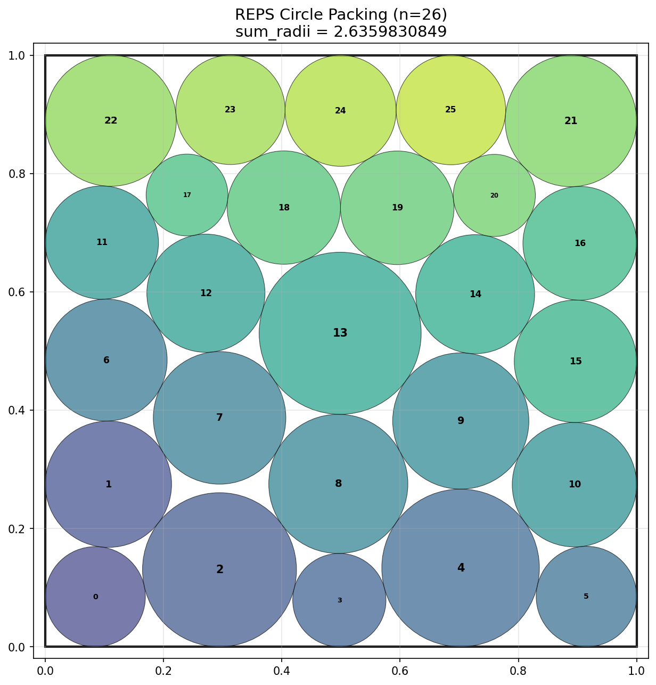

<h1 align="center">REPS</h1>

<p align="center">A self-improving evolutionary code search agent that reflects, diversifies, and steers.</p>

<p align="center">
  <a href="https://colab.research.google.com/github/google-deepmind/alphaevolve_repository_of_problems/blob/main/experiments/packing_circles_max_sum_of_radii/packing_circle_max_sum_of_radii.ipynb"></a>
  
</p>

REPS evolves programs with an LLM-driven loop that reflects between batches, balances explorer/exploiter workers, detects convergence, and steers compute by distance to a known target.

## Result: Circle Packing n=26

| System | sum_radii | Iterations | Model |
|---|---|---|---|
| Prior SOTA | 2.634 | — | — |
| OpenEvolve (shipped best) | 2.6342924 | 470 | gemini-2.0-flash + claude-3.7-sonnet |
| AlphaEvolve (paper) | 2.6358628 | — | Gemini 2.0 Pro |
| FICO Xpress Solver | 2.6359155 | — | — |
| **REPS** | **2.6359831** | **100** | **claude-sonnet-4.6** |

Verified against [DeepMind's official validator](https://colab.research.google.com/github/google-deepmind/alphaevolve_repository_of_problems/blob/main/experiments/packing_circles_max_sum_of_radii/packing_circle_max_sum_of_radii.ipynb).



## What REPS does

- **Adaptive selection** — `selection_strategy="map_elites" | "pareto" | "mixed"` with `pareto_fraction` for blending MAP-Elites bins and per-instance Pareto fronts. (`reps/api/optimizer.py:64`, GEPA Phase 2)
- **Trace reflection** — `trace_reflection=True`: the reflection LLM sees per-instance scores + feedback from the parent's failures, not just aggregate scores. (`reps/api/optimizer.py:66`, GEPA Phase 3)
- **Ancestry-aware reflection** — `lineage_depth=N`: extends reflection with the last N parents in a candidate's chain. (`reps/api/optimizer.py:67`, GEPA Phase 5)
- **System-aware merge** — `merge=True`: candidates from different islands recombine via an LLM-driven merge prompt that targets disjoint instance dimensions. (`reps/api/optimizer.py:68`, GEPA Phase 4)
- **Convergence + SOTA steering** — built-in convergence monitor (edit entropy + strategy divergence) and gap-aware compute steering when a target score is set. On by default.

## Status: pre-1.0

REPS is pre-1.0. The Python API
([`docs/python_api_spec.md`](docs/python_api_spec.md)) shipped recently
and may still evolve. Per [`docs/release_spec.md`](docs/release_spec.md),
minor version bumps (0.1 → 0.2) may include breaking changes during
the pre-1.0 era. Pin to a specific minor version (e.g.
`reps-search==0.1.*`) if you need stability across upgrades. Strict
semver applies once REPS reaches 1.0.0.

## Install

Requires Python 3.12+ and [uv](https://docs.astral.sh/uv/).

```bash
git clone https://github.com/zkhorozianbc/reps.git
cd reps
uv venv .venv --python 3.12
uv pip install -e .
```

PyPI publish is in flight; this README will be updated to `pip install reps-search` once the package lands. Optional extras: `[dspy]` (the `dspy_react` worker), `[benchmarks]` (`scipy` + `matplotlib` for the bundled circle-packing benchmark).

Set the API key matching your model's provider:

```bash
export ANTHROPIC_API_KEY=sk-ant-...      # provider: anthropic
export OPENROUTER_API_KEY=sk-or-...      # provider: openrouter
export OPENAI_API_KEY=sk-...             # provider: openai
```

A sibling `.env` file is auto-loaded.

## Quick start (Python)

REPS is a Python library. Pass a seed program string and an evaluator callable; get back the best evolved program.

```python
import reps

def evaluate(code: str) -> float:
    # Run the candidate, return a score. Higher is better.
    namespace = {}
    exec(code, namespace)
    return float(namespace["solve"]())

result = reps.Optimizer(
    model="anthropic/claude-sonnet-4.6",   # api_key from $ANTHROPIC_API_KEY
    max_iterations=20,
).optimize(
    initial=open("seed.py").read(),
    evaluate=evaluate,
)

print(result.best_score)
print(result.best_code)
```

## What's an evaluator?

An evaluator is any `Callable[[str], float | dict | reps.EvaluationResult]`. REPS calls it with the candidate program text and uses the returned score to drive selection. Return a `float` for a quick start, a `dict` with `combined_score` and optional `per_instance_scores` / `feedback` for richer signal, or a `reps.EvaluationResult` to unlock the per-objective Pareto + trace-reflection paths described in [`docs/python_api_spec.md`](docs/python_api_spec.md).

```python
def eval_simple(code: str) -> float:    return 1.0
def eval_dict(code: str) -> dict:       return {"combined_score": 0.9, "feedback": "..."}
def eval_full(code: str) -> reps.EvaluationResult: ...
```

## GEPA-style features (constructor knobs)

| Kwarg | Effect | Default |
|---|---|---|
| `selection_strategy` | `"map_elites"` (REPS classic), `"pareto"` (GEPA-style frontier), or `"mixed"` | `"map_elites"` |
| `pareto_fraction` | Blend ratio when `selection_strategy="mixed"` | `0.0` |
| `trace_reflection` | Reflection sees per-instance scores + feedback, not aggregates | `False` |
| `lineage_depth` | How many ancestors the reflection prompt sees | `3` |
| `merge` | Enable LLM-driven cross-island merge | `False` |
| `num_islands` | Population islands for diversity | `5` |
| `max_iterations` | Search budget | `100` |
| `output_dir` | Persist run artifacts; `None` ⇒ tempdir | `None` |

Full surface (escape hatches, model knobs, deferred kwargs) in [`docs/python_api_spec.md`](docs/python_api_spec.md).

## Reusing a Model

Most users pass a model-name string to `Optimizer(model=...)`. Build a `reps.Model` directly when you want to call the model outside the optimizer or share one configured client across multiple runs.

```python
import reps

model = reps.Model("anthropic/claude-sonnet-4.6", temperature=0.7)
print(model("hello"))                                    # standalone use

# Share one Model across multiple optimizers
o1 = reps.Optimizer(model=model, max_iterations=20)
o2 = reps.Optimizer(model=model, max_iterations=50, merge=True)
```

## Power-user: CLI / YAML

For batch experiments, reproducible sweeps, or YAML-driven configuration, REPS ships a CLI: `reps-run --config <yaml>`. The Python API above is built on the same engine, so anything achievable via YAML is achievable via `Optimizer(...)` plus `Optimizer.from_config(cfg)`.

### Run

Everything lives in the YAML — point `reps-run` at a config and go:

```bash
reps-run --config experiment/configs/circle_sonnet_reps.yaml
```

Results land in `experiment/results/<config-stem>/run_NNN/` (auto-versioned). The best program is saved as `best_program.py`; per-iteration metrics under `metrics/`.

Common overrides:

```bash
reps-run --config <yaml> --iterations 50 --output my_runs/
reps-run --config <yaml> -o llm.temperature=0.9 -o reps.batch_size=10
```

The config decides everything else — model, workers, harness (`reps` or `openevolve`), and which benchmark to evolve (via `task:`).

### Add a benchmark

Drop two files into `experiment/benchmarks/<name>/`:

```
experiment/benchmarks/<name>/
├── initial_program.py    # seed code (wrap evolvable region in EVOLVE-BLOCK markers)
└── evaluator.py          # defines evaluate(program_path) -> {"combined_score": float, ...}
```

`initial_program.py`:

```python
# EVOLVE-BLOCK-START
def solve():
    return naive_result
# EVOLVE-BLOCK-END
```

`evaluator.py`:

```python
def evaluate(program_path):
    # import program_path, run it, score it
    return {"combined_score": score}
```

Optional files in the same directory:
- `system_prompt.md` — task-specific system prompt (auto-loaded)
- `visualize.py` — `visualize_from_program(path, save_path)` for best-program plots

Then point a config at it:

```yaml
task: ../benchmarks/<name>     # resolved relative to this YAML
max_iterations: 100
provider: anthropic
# ... see experiment/configs/circle_sonnet_reps.yaml for a full example
```

Run it: `reps-run --config experiment/configs/<your_config>.yaml`.

For cascade evaluation, also define `evaluate_stage1` / `evaluate_stage2`. If the primary objective metric isn't `combined_score`, set `reps.sota.target_metric:` so SOTA steering compares the right value.

### Configs

Reference configs in `experiment/configs/`:

- `circle_sonnet_reps.yaml`, `circle_opus47_anthropic.yaml`, `reps_full.yaml` — full REPS runs
- `verify_*.yaml` — minimal smoke tests, one per worker impl
- `circle_base.yaml`, `circle_sonnet_base.yaml` — `harness: openevolve` baselines (`uv pip install openevolve`)

`reps/config.py` is the source of truth for every field and default.

## Tests

```bash
uv run python -m pytest tests/
```

## Design docs

- [`docs/python_api_spec.md`](docs/python_api_spec.md) — the v1 Python API contract: every public class, kwarg, return shape, with file:line references into the implementation.
- [`docs/gepa_implementation_plan.md`](docs/gepa_implementation_plan.md) — phase-by-phase rollout plan for the GEPA-inspired features (Pareto selection, trace reflection, merge, ancestry-aware reflection).
- [`docs/optimizer_engine_separation_spec.md`](docs/optimizer_engine_separation_spec.md) — internal refactor splitting the public `Optimizer` facade from the runtime engine.

## Acknowledgements

Forked from [OpenEvolve](https://github.com/algorithmicsuperintelligence/openevolve); now self-contained.
